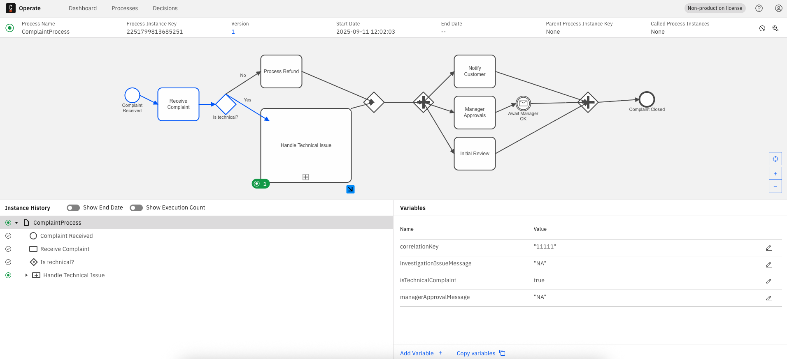

# BPMN Demo: Comparison between Camunda, jBPM and Activiti

This repository demonstrates a **BPMN process model** that includes:

- **Human Task**
- **Sub Process**
- **Swimlanes (Pools & Lanes)**
- **Conditional decision (Gateway)**
- **Parallel Gateway**
- **Receive external message**

The goal is to compare the implementation and execution of the same process on **Camunda**, **jBPM**, and **Activiti**, using **only open-source features** and the **latest stable versions** of each platform.

---

## Customer Complaint Process – Process Description

This BPMN process models the handling of customer complaints. It coordinates actions between Customer Service, Technical Support, and Management, ensuring efficient resolution and tracking.

### **Process Steps**

1. **Complaint Received**
    - The process starts when a customer complaint is received.

2. **Receive Complaint**
    - The complaint is logged and reviewed by Customer Service.

3. **Is Technical?**
    - The process evaluates whether the complaint is technical.
    - If **yes**, it moves to the technical issue resolution (subprocess).
    - If **no**, it proceeds to process a refund.

#### **Technical Issue Subprocess**
- **Investigate Issue:** Technical Support investigates the reported problem.
- **Await Fix:** Waits for an external "TechnicalFixComplete" message.
- **Fix Issue:** Technical Support resolves the issue.
- **End Subprocess**

#### **Refund Path**
- **Process Refund:** Customer Service handles the refund procedure.

4. **Paths Join**
    - Both technical and refund paths converge for further processing.

5. **Parallel Activities**
    - Multiple tasks begin in parallel:
        - **Notify Customer:** Inform the customer of resolution steps or completion.
        - **Manager Approvals:** Management reviews and approves actions, awaiting an external "ManagerApproval" message.
        - **Initial Review:** An additional review may be performed.

6. **Final Join**
    - All parallel tasks rejoin.

7. **Customer Complaint Closed**
    - The process ends, marking the complaint as resolved.


### **Key Features**

- **Message Correlation:** Waits for external signals (technical fix and manager approval), ensuring event-driven continuation.
- **Parallel Task Handling:** Multiple activities can occur simultaneously, improving efficiency.
- **Role-Based Collaboration:** Involves three participant lanes for proper task separation.

---

## Repository Structure

```
.
├── bpmn-models/
│   ├── camunda-version.bpmn    # Adjusted for Camunda
│   ├── jbpm-version.bpmn       # Adjusted for jBPM
│   └── activiti-version.bpmn   # Adjusted for Activiti
├── camunda/
│   ├── docker-compose.yml      # Camunda environment
├── jbpm/
│   ├── docker-compose.yml      # jBPM environment
├── activiti/
│   ├── docker-compose.yml      # Activiti environment
└── README.md  # this file
```

---

## Prerequisites

- **Docker** and **Docker Compose** installed
- **Git** installed
- At least **4GB of free RAM** for containers

---

## Installation and Startup

### 1. Clone the repository

```bash
git clone https://github.com/<your-username>/bpmn-demo-comparison.git
cd bpmn-models
```

### 2. Run the environments separately

Each engine has its own `docker-compose.yml` file under its folder.

#### Camunda Platform 8 (Open Source)

```bash
cd camunda
docker compose up -d
```
- Running components can be accessed with the username _demo_ and password _demo_:
- Operate: http://localhost:8081
- Tasklist: http://localhost:8082
- Identity: http://localhost:8084
- Elasticsearch: http://localhost:9200
- Keycloak is used to manage users, and can be accessed with the user _admin_ and password _admin_:
Keycloak: http://localhost:18080/auth/
- The workflow engine Zeebe is available using gRPC http://localhost:26500

**Deploy the process:**

```bash
docker run --rm --network camunda_camunda-platform \
-v "$(pwd)/bpmn-models/camunda-version.bpmn:/models/camunda-version.bpmn" \
sitapati/zbctl \
--insecure \
--address zeebe:26500 \
deploy /models/camunda-version.bpmn
```

**Start a new process instance:**

```bash
docker run --rm --network camunda_camunda-platform \
  sitapati/zbctl \
  --insecure \
  --address zeebe:26500 \
  create instance ComplaintProcess --variables '{"isTechnicalComplaint": true, "correlationKey": "11111", "eventTechId": "someTechId", "eventManagerId": "someManagerId"}'
```

Connect to Operate: http://localhost:8081 to interact with the process.



---

#### jBPM (Business Central + KIE Server)

```bash
cd jbpm
docker compose up -d
```

- Running components can be accessed with the username _wbadmin_ and password _wbadmin_:
- Business Central at: [http://localhost:9081/business-central]
- KIE Server at: [http://localhost:9082]

**Deploy the process:**

You do NOT deploy directly via REST API:
You upload the BPMN file in Business Central via the web UI.
Business Central will deploy to KIE Server automatically.

Steps:

- Open http://localhost:9081/business-central in your browser. 
- Login (_wbadmin_ / _wbadmin_). 
- Design section, Create a space
- Inside the new Space, create a project named Complaint and version 1.0.0
- Import bpmn-models/jbpm-version.bpmn BPMN file. 
- Click Build & Deploy.

**Start a new process instance:**

```bash
docker exec jbpm-bpm curl -u wbadmin:wbadmin -H "Content-Type: application/json" -X POST http://localhost:8080/kie-server/services/rest/server/containers/Complaint_1.0.0/processes/ComplaintProcess/instances -d '{"isTechnicalComplaint": true}'
```

Connect to Business Central: http://localhost:9081 to interact with the process.


#### Activiti (Community Edition)

TODO

---

## Sending External Messages via REST API

Each engine exposes an API to send signals/messages. Below are sample `curl` commands.

### Camunda 8 (Zeebe)

TODO

### jBPM

Signal Message Await Fix:

```bash
docker exec jbpm-bpm curl -u wbadmin:wbadmin -H "Content-Type: application/json" -X POST http://localhost:8080/kie-server/services/rest/server/containers/Complaint_1.0.0/signals/TechnicalFixComplete -d '{"investigationIssueMessage": "Investigation OK"}'
```

Signal Message Await Manager OK:

```bash
docker exec jbpm-bpm curl -u wbadmin:wbadmin -H "Content-Type: application/json" -X POST http://localhost:8080/kie-server/services/rest/server/containers/Complaint_1.0.0/signals/ManagerApproval -d '{"managerApprovalMessage": "Approved"}'
```

---

## Technology Comparison

| Feature                | Camunda 8 OSS      | jBPM 7+           | Activiti 7 |
|------------------------|--------------------|-------------------|------------|
| BPMN Modeling          | BPMN 2.0 full      | BPMN 2.0 full     | BPMN 2.0 subset |
| Human Task             | ✅                 | ✅                | ✅ |
| Sub Process            | ✅                 | ✅                | ✅ |
| Swimlanes              | ✅                 | ✅                | ✅ |
| Parallel Gateway       | ✅                 | ✅                | ✅ |
| Conditional Gateway    | ✅                 | ✅                | ✅ |
| External Message Event | ✅ (REST API)      | ✅ (REST/Signal)  | ✅ (REST API) |
| UI / Monitoring        | Zeebe Operate      | Business Central  | Activiti Explorer |

---